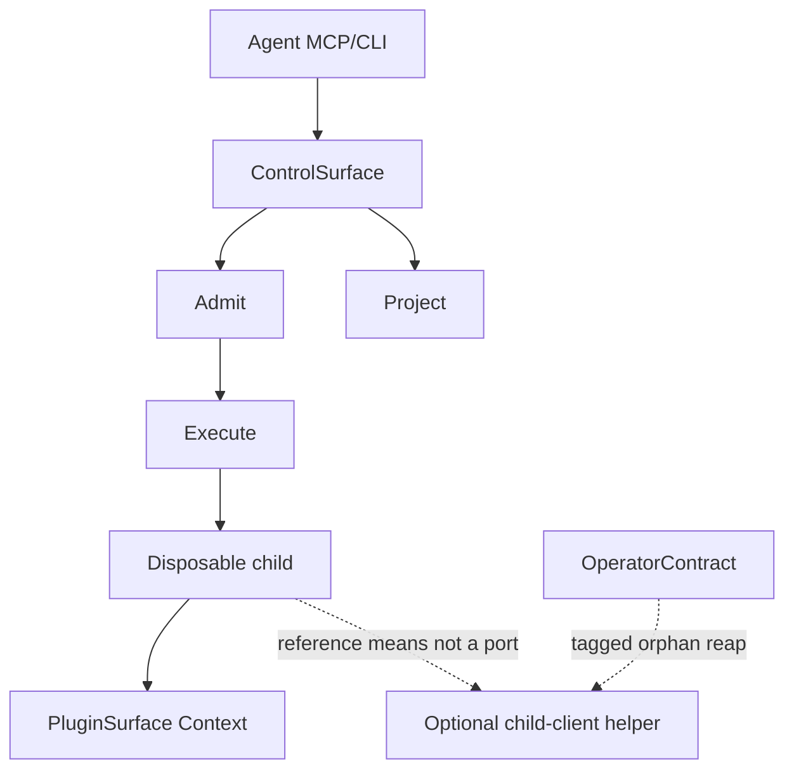

# Trestle — TTY-class oneshot overlay (complementary HLD)

Scope: system  
Node: trestle-kernel  
Mode: amend (complement; freeze HLD remains the working set)  
Amendment: tty-class-overlay  
Supersedes: none (does not replace the freeze HLD)

This document complements [Interfaces Architecture](hld-interface-architecture-trestle.md). It does not rewrite the three Kernel ports, does not add a tenth MCP tool, and does not open a Control port.

**Implementation freeze of the Kernel agreement remains in force.** Overlay kinds below are additive constraints on that agreement. Field-level consumer contract: [TTY-class oneshot overlay contract](interface-design-tty-class-trestle.md).

## Guiding Light

Upstream calls this document must serve. Plain language; no requirement IDs.

**Upstream:** [Requirements (Draft v0.7)](../trestle-requirements.md); [Interfaces Architecture (freeze)](hld-interface-architecture-trestle.md)

### Why this project exists

- Same job as the rest of Trestle: keep local command-line work agent-friendly. Terminal-sensitive work is still that job — or a clear “leave” — not a second dump into context.

### What must be true upstream

- No fourth Kernel port, no tenth MCP tool, no Control port for live stdin or resize.
- Class advertisement lives on the catalog; readiness lives at admission; console bytes file through existing Context sinks; gap counts ride the status frame the agent already holds.
- Ordinary POSIX local work remains complete without any terminal helper installed.

### This document's job

- Add overlay rules only — complement the freeze HLD without rewriting it.

---

## Summary

Agents either complete terminal-sensitive local work through the same ten tools they already use, or they can see from the public catalog and the door that they must leave Trestle — never a silent hole, and never a new climate of ports, tools, or vendor session ids. Publication of that optional class lives on the catalog; pulse lives at admission; console bytes file through existing Context sinks; counted gaps ride the status frame the agent already holds. Which program supplies a terminal is not a Kernel port: when the capability ships, means sit in a disposable child behind PluginSurface, the wrapper’s pump stays pipe-capture, and operators reap tagged orphans if a helper process outlives the child. Ordinary POSIX local work remains complete without that helper installed.

---

## References

- [Requirements (Draft v0.7)](../trestle-requirements.md) — G9, R-REACH-1, R-TTY-1–9; unreadiness channel `admission.tty_not_ready` (R-TTY-6); also R-INV-1, R-MCP-1, R-CTX-2, R-AUTO-1–7, R-BOUND-1–6, R-REG-5, R-LIM-5, Dual-error / request-versus-run
- [Interfaces Architecture (freeze)](hld-interface-architecture-trestle.md) — three ports, ControlSurface, ten tools, Dual-error, Handle grammar, DefaultAgentSuccess, ViewRow freeze, PluginSurface members
- [TTY-class oneshot overlay contract](interface-design-tty-class-trestle.md) — settled consumer seam (class advertisement, one unreadiness code, Context filing, `limits_exceeded` bind)
- Adoption memo (means, not Kernel identity): `memo-forge-adoption-trestle.md` — optional unnamed child-client helper; do not treat as a fourth port or MCP tool

---

## Goals & Non-Goals

**Goals**

- **Target.** An agent can complete TTY-class oneshot work as an ordinary run (same handles, named views, fetch windows), or can observe a named exclusion and leave Trestle.
- **Target.** Advertised-but-not-ready is a request refusal with no run identity — distinguishable from source-validation failure and from a failed run.
- **Target.** Console evidence is Kernel-owned bytes plus counted suppressions; a finished-looking projection with uncounted loss is a contract miss.
- **Current (preserve).** Ordinary POSIX local work (milestones M1–M7) is already complete on pipe-capture without this capability.
- **Current (preserve).** Plugin authors remain correct with frozen Context **public** members and a stub that can record `tty_console` wrap.

**Non-goals**

- Rewriting or replacing the freeze HLD; inventing a fourth Kernel port; adding a tenth MCP tool.
- Opening a Control port (agent-driven stdin, resize, signal-as-agent-verbs) in this amendment.
- Live observation of a still-running run; agent-delegation-as-primary product bets.
- Making TTY-class execution the default route for ordinary commands.
- Naming a vendor in Kernel identity, requirement MUST text, or agent-visible grammar.
- Freezing helper topology (which PTY program, daemon vs in-child vs sidecar) as a Kernel agreement.

**Constraints**

- The freeze conclusions remain true: three ports; ControlSurface composes Admit + Project; Door = Admit only; Execute’s only consumer is Conductor; Context is not a Kernel port; FastMCP is a porch; ProjectionContract freeze; `wait_ms` only on `ControlSurface.run`; catalog is a Project `CatalogView`.
- Oneshot only. Interactive control and live tail stay behind named requirements entry conditions.
- Pipes remain the default execution path (R-CTX-2). Wrapper capture of the child stays pipe-capture even when a TTY helper is present inside the child.
- Untrusted helper bytes enter the MCP process only as bounded projection (R-INV-1). Helper session identifiers die in the child.
- Deleting the means MUST leave ten tools, existing handle prefixes, and M1–M7 true.
- Kernel-private readiness at Admit MUST NOT execute, wait, or return summaries in order to learn unreadiness.
- Freeze **thin `tools/list`**: this overlay MUST NOT enlarge MCP tool definitions (no plugin/TTY/Forge schema on `tools/list`, no inlined `run` args schema). Class lives on `CatalogView`; depth stays `describe_plugin` pull-for-one.

---

## Key Design Decisions

These five choices govern every overlay interface. Local field tables live in [External Interfaces](#external-interfaces) and in the [consumer contract](interface-design-tty-class-trestle.md).

1. **Seam freeze.** The complementary HLD freezes the consumer seam already in the interface-design artifact: vendor-neutral TTY-oneshot class advertisement over a **full** default-catalog walk; exactly one unreadiness refusal (`admission.tty_not_ready`); Context existing sinks; Dual-error after admit; counted TTY gaps on existing `RunView.limits_exceeded` (R-LIM-5). Do not grow a catalog health cell, a Context TTY member, or a second completeness porch.

2. **Topology deferral.** Which program supplies a PTY — daemon, in-child PTY, sidecar — is **not** a Kernel port and is not a prerequisite of the architecture agreement. Advertise-and-refuse (class present, Door refuses) can ship while pipes remain the only execution path. Named workloads that prove demand may later select a means; that selection does not amend Admit, Project, or the nine-tool family.

3. **Isolation firewall.** When the optional capability is shipped, means sit behind PluginSurface in a **disposable child**. The wrapper pump stays pipe-capture of that child. Kernel freeze text never names a vendor. Session ids, drain cursors, and helper URLs do not cross onto `RunView`, `RequestOutcome`, `CatalogView`, or returned handles. Tagged-orphan reap is operator work when a means ships (internals), not an exported overlay kind.

4. **Reference means, not identity.** Caller intent includes an optional unnamed child-client helper in the Trestle application. This HLD describes that helper in [Internal Implementation](#internal-implementation) as the **reference child-client** (Forge is the example means). It is not a fourth port, not an MCP tool, and not Kernel vocabulary. Substituting or deleting it MUST NOT change agent grammar.

5. **Do not thicken the porch.** Overlay kinds are envelope fields and one `admission.*` code. They are not extra `tools/list` bytes, not a per-plugin MCP tool, and not a helper JSON-RPC schema in the agent context (G1).

---

## Shared Foundations

Define once; overlay interfaces reference. Envelope families, Dual-error, Handle prefixes, DefaultAgentSuccess, and the nine-tool Semantic Contract Table remain in the [freeze HLD](hld-interface-architecture-trestle.md) — do not fork them here.

### Three mouths (do not merge)

| Mouth | Information expert | What it is not |
|-------|--------------------|----------------|
| **Publication** | Project / registry (`CatalogView`) | Pulse, health, readiness |
| **Pulse** | Admit (Door) | A catalog cell; Execute; a failed run |
| **Filing** | Kernel evidence via Context `artifact` / `attach` (R-CTX-4 / §9). Freeze owners (R-STORE-6): child `work/*`, wrapper `console/*`; Kernel observes files; nobody speaks LedgerCommand from the child. Drain writes R-LIM-3 (`tty_console`) into child-owned `work/` files Execute already watches; Kernel merges both owners into one `limits_exceeded` via one `limit_exceeded` promotion | New Context member; author `log` / `progress` as completeness porch; helper URLs on the porch; wrapper `run_tail` as TTY terminus |

### Class presence (normative)

Let **default catalog** mean `list_plugins` without `invalid=True`. Let **default-catalog publication** mean walking that listing until `truncated` is false.

```
tty_oneshot_advertised ⇔
  ∃ page in the default-catalog publication
    ∃ row in page.items
      where row.valid is true
        and row.capability_class == "tty-oneshot"
```

**Absence** (named exclusion, leave-Trestle): `tty_oneshot_advertised` is false after that walk. A single truncated page is not absence. `valid` remains source validation (R-REG-5) and MUST NOT mean helper health. `capability_class` is **always present** on every row; no class claim is JSON `null`, not an omitted field.

### Three mutually exclusive agent stories

1. **Absence** — no valid `tty-oneshot` row on the completed default-catalog walk → leave Trestle.
2. **Unreadiness** — class advertised; Admit refuses with `admission.tty_not_ready`; **no** `run_id`.
3. **Failed run** — Admit minted a Handle; helper death or work failure → terminal `RunView`; pre-failure evidence retained.

---

## External Interfaces

Overlay **deltas only**. Admit, Execute, Project, ControlSurface, nine MCP tools, Dual-error, Handle grammar, DefaultAgentSuccess, ViewRow freeze, fetch windows, and PluginSurface **members** remain as specified in the [freeze HLD](hld-interface-architecture-trestle.md). This section binds four additive kinds onto those types: class advertisement, one unreadiness code, `limits_exceeded` MUST-write, Context filing invariants. Operator reap is not a signed kind.

### PluginCatalogRow / CatalogView — class advertisement

Agents must be able to see whether this install claims TTY-oneshot work without guessing filenames and without treating one truncated page as the publication.

| Field | Value |
|-------|-------|
| Purpose / intent | Publish an optional vendor-neutral class claim on a registry row |
| Consumers / Producers | MCP/CLI agents (`list_plugins`); Kernel registry publication |
| Shape | Existing `CatalogView` + `PluginCatalogRow.capability_class` **always present**: `tty-oneshot` or JSON `null` (no claim). Omit is a contract miss. Unknown non-null strings are ignored by TTY-class consumers, not treated as `tty-oneshot` |
| Rationale | Catalog’s reason-to-change stays registry publication. Class is a billboard, not a pulse. Column bump does not bump nine query ViewRows |
| Status | proposed (overlay); freeze fields `name`, `version`, `description`, `valid` unchanged |
| Withheld | Helper topology, vendor names, ready/health bit, schemas |

`description` remains a teaser. `describe_plugin` MAY mention TTY-class oneshot as side-effect honesty; that prose is **not** the class type. `registry_version` ticks when the last `tty-oneshot` row disappears. Porch `tools/list.registry_version` MUST continue to mirror `CatalogView.registry_version` on the same publication.

Several rows MAY advertise the same token (multiple plugins in one class).

### Admit — one unreadiness code

Door must refuse advertised-but-not-ready work as a **request**, never as a ledger row that pretends the work ran.

| Field | Value |
|-------|-------|
| Purpose / intent | Distinguish helper unreadiness from identity miss, source-validation failure, and post-admit failure |
| Consumers / Producers | Door / `ControlSurface.run`; Kernel-private readiness (not Execute) |
| Shape | Existing tagged `AdmitResult`. New code only: `admission.tty_not_ready` (`origin=admission`, `retryable=false`). Tagged `Refused`. No `run_id`. No ledger `created` |
| Rationale | Freeze already extends via `admission.*` without new `RunView` fields. One code — not a junk drawer per helper. `retryable=false` so agents do not hammer `run` as a health probe |
| Status | proposed (overlay); all other `admission.*` codes unchanged |
| Withheld | How Admit probes readiness; helper URLs; Execute internals |

**MUST NOT appear when:** a Handle was admitted; the class is unpublished (that is absence / identity refusal, not this code); source validation failed (`valid=false` / R-REG-5); the run already exists.

Orthogonal: `admission.plugin_not_found` remains unpublished **identity**. Class-level leave-Trestle is “no `tty-oneshot` row,” not a guessed filename.

Post-admit helper death is **not** this code. After durable `created`, Dual-error maps helper death to a terminal `RunView`. Belated `admission.*` after a Handle exists is a contract crime.

### RunView — counted TTY gaps on the existing status frame

Agents must query completeness of TTY-class console on the frame they already hold — not a new view, tool, or Context member.

| Field | Value |
|-------|-------|
| Purpose / intent | Bind R-TTY-3 to existing `limits_exceeded` (R-LIM-5) |
| Consumers / Producers | Agents via `run` / `await_runs` / Project `status`; Kernel is information expert |
| Shape | Unchanged `RunView`. Kernel **merges** wrapper `stdout`/`stderr` markers and child `tty_console` markers into **one** `RunView.limits_exceeded` (R-STORE-6: observe both file owners; one LedgerCommand `limit_exceeded` promotion). `None`/omit = not checked (any class) — never coerce pipe-only `None` to `[]`. Empty list on a TTY-class **terminal** is legal **only after** the `tty_console` check ran (child `work/` observation present, possibly zero suppression). Non-empty = counted gaps (`bytes_suppressed`). Omit on that class = contract miss. Helper-transport holes use `LimitExceededMarker.stream` = `tty_console`. Any TTY-class gap on that merged list forces `evidence_finalized` `completeness`=`partial`; agent-visible equivalent remains `limits_exceeded`. Class stays `CatalogView.capability_class`; Kernel MAY keep a private admit snapshot for MUST-write (not agent grammar). After a `tty-oneshot` row is unpublished, completeness is the list on that run’s terminal frame — not current catalog, not None-as-class |
| Rationale | R-TTY-3: absence of a suppression on a **written** list means no gap was observed. Omit means not checked. Incomplete classification follows from those markers, not a second unnamed channel or a porch `completeness` cell |
| Status | overlay bind onto freeze status-frame member (freeze amendment `tty-overlay-kinds`; this overlay `tty-class-overlay` owns MUST-write) |
| Withheld | Helper `droppedBytes`; author `log`/`progress` as completeness porch; helper URLs; a second unnamed channel |

TTY-class oneshot, when admitted and ready, uses the same handle grammar, named views, and fetch windows as any other run. Console that satisfies R-REACH-1 is attached evidence (`art_…`) fetched with existing fetch windows — **not** `query(run_tail)` and **not** wrapper `console/*`. Empty `run_tail` is not completed TTY work. No new ViewName.

### PluginSurface (`trestle.Context`) — filing invariants only

Authors must file TTY console as ordinary evidence without a new Context member and without `run_cmd` becoming the TTY-class path.

| Field | Value |
|-------|-------|
| Purpose / intent | Drain oneshot console into existing `artifact`/`attach` (R-CTX-4); TTY drain writes R-LIM-3 into child-owned `work/` files Execute already watches; Context implementation promotes — no new public member |
| Consumers / Producers | Plugin authors in the disposable child |
| Shape | **Public members unchanged** from the freeze (`artifact`, `attach`, `copy_artifact`, `retain`, `run_cmd`, `log`/`progress`, `tmp`, `outputs`, `cancelled`, `deadline`). Overlay adds **no** member. `outputs` is the freeze automatic keeper tree (R-AUTO-3), not a TTY sink. |
| Rationale | Missing sinks MUST NOT be solved by growing scheduler, query, pin, or Control APIs onto Context. Ordinary non-TTY commands stay on `run_cmd` |
| Status | overlay invariants; freeze member set frozen |
| Withheld | Drain poll, encoding, ring size, daemon URL, vendor SDK on the porch |

**Overlay invariants (additive):**

- Helper session identifiers, daemon URLs, and drain-loop cursors die in the child. Helper URLs MUST NOT appear on the porch.
- Freeze owners hold: child owns `work/*`; wrapper owns `console/*`; Kernel observes files; nobody speaks LedgerCommand from the child.
- Plugin authors still only call frozen Context members (`artifact`/`attach`). All Context output is subject to §9 (R-CTX-4). Author `log`/`progress` MUST NOT be the completeness porch.
- **Injection path (R-TTY-3 — inverted observation, no new Context method):** TTY drain (plugin or helper client in the child) is Information Expert for **detecting wrap**. It MUST write R-LIM-3 records into **child-owned `work/` observation files Execute already watches** for Context §9 / R-CTX-4, with `stream=tty_console`, **before** `attach` completes. Drain MUST NOT concatenate across a hole. Context **implementation** (child runtime) is Information Expert for **promoting** those files to Kernel observation. That obligation is a **PluginSurface runtime dependency**, not a new public member and not Kernel types in plugin code. Stub Context for tests MUST be able to record `tty_console` markers when a test drain reports wrap. Incomplete classification follows from Kernel-written markers, not a second unnamed channel.
- TTY-class plugins that drain via unmanaged `open()` around Context fail this overlay (R-SCOPE-2 / R-TTY-3).
- Helper drain MUST honor `cancelled` / `deadline`. In-child stop does not require a Control port.
- Helper unreachable **after** admit is a terminal run. Authors cannot emit `admission.*`.

### MCP tools (overlay rows only)

Nine tools remain. Tools not listed are unchanged from the freeze Semantic Contract Table.

| Tool | Overlay postcondition | Forbidden confusions |
|------|----------------------|----------------------|
| `list_plugins` | Items **always include** `capability_class` (`tty-oneshot` or JSON `null`; omit is a miss). Class-level leave-Trestle is no valid `tty-oneshot` row on the completed default-catalog walk. `valid` still means R-REG-5 only. No schemas (R-MCP-2). Does not enlarge `tools/list` | Not a health API. Not `describe_plugin` as class type. Not one truncated page as the publication. Not treating an omitted field as no claim. Not a schema dump onto the MCP definition |
| `run` | Advertised `tty-oneshot` identity not ready → `isError: true` + `admission.tty_not_ready`, no `run_id`. Unpublished identity → `admission.plugin_not_found`. Admitted → `RunView` (DefaultAgentSuccess); helper death after admit is terminal `RunView` | Not Execute-as-probe. Not Control stdin/resize. Not `wait_ms` as a readiness flag |
| `query` | Named views unchanged (no new ViewName). `query(run_tail)` is wrapper `console/*` pipe tails | Not the TTY-class terminus. Empty `run_tail` is not completed TTY work (R-REACH-1) |
| `fetch` | TTY-class console that satisfies R-REACH-1 is attached evidence (`art_…`) with existing fetch windows | Not wrapper `console/*`. Not a new window kind |

---

## Consumer Sufficiency

**MCP/CLI agent.** Walk `list_plugins` until `truncated` is false (`capability_class` present on every row; `null` = no claim). Either a valid `tty-oneshot` row exists, or it does not (named exclusion). If it exists, `run` either refuses with `admission.tty_not_ready` (no `run_id`) or returns a `RunView` using DefaultAgentSuccess, the same named views, and the same fetch windows. TTY-class console is `fetch` of attached `art_…`; `query(run_tail)` is not the terminus. Terminal TTY-class frames carry merged `limits_exceeded`. No tenth tool, no vendor session id, no Control verbs. Pipe-only agents ignore the class **value**. Proof pack: [consumer contract](interface-design-tty-class-trestle.md#consumer-scenario-proof-pack).

**Plugin author.** Frozen Context **public** members plus overlay filing invariants are enough: stage console with `artifact`, promote with `attach`, honor `cancelled`/`deadline`, return a small mapping. Wrap detection is a PluginSurface **runtime** dependency (drain writes `work/` R-LIM-3; implementation promotes). Stub Context MUST be able to record `tty_console` markers when a test drain reports wrap. Authors do not emit admission codes, catalog columns, or Kernel types.

**Operator.** `doctor` / `recover` can sweep `run_id`-tagged helper sessions that outlive the child without widening MCP.

If an agent needed a new tool, a Control port, a catalog health cell, or a vendor session id to finish the job, this overlay would be insufficient — those are withheld by design.

---

## Provider Sufficiency

| Obligation | How this unit fulfills it without new ports |
|------------|-----------------------------------------------|
| Reach or visible exclusion (R-REACH-1) | Class token on completed default-catalog walk **or** absence of that token; Door unreadiness when advertised but not ready; admitted TTY console via `fetch(art_…)`, not empty `run_tail` |
| Optional, not M1 machinery (R-TTY-1) | Capability unpublished → M1–M7 still complete on pipe-capture; publication is a plugin row |
| Same identity/evidence class (R-TTY-2) | Existing ten tools, Handle prefixes, ViewNames, fetch windows; DefaultAgentSuccess |
| Counted gaps (R-TTY-3) | Drain writes R-LIM-3 (`stream`=`tty_console`) into child `work/` files Execute already watches, before `attach`; Context implementation promotes (runtime dependency, not a new member). Kernel merges wrapper `stdout`/`stderr` **and** `tty_console` into one `limits_exceeded` (R-STORE-6, one `limit_exceeded` promotion). Empty TTY-class terminal list only after that check — never pipe-only `None` coerced to `[]`. Non-empty merged TTY gap ⇒ `evidence_finalized` `completeness`=`partial`; agent porch stays `limits_exceeded`. Drain MUST NOT concatenate. Unmanaged `open()` around Context fails the overlay |
| Refuse vs fail vs incomplete (R-TTY-4) | Tagged `Refused` at Admit; Dual-error terminal run after admit; agent completeness on `limits_exceeded`; ledger `completeness`=`partial` when that list has a TTY-class gap |
| Absence visible (R-TTY-5) | No valid class row after full catalog walk |
| Unreadiness ≠ R-REG-5 (R-TTY-6) | One code `admission.tty_not_ready`; `valid` unchanged |
| Means deletable, unnamed (R-TTY-7) | Helper behind PluginSurface; Kernel never names a vendor; delete plugin file → absence |
| Pipes default (R-TTY-8) | Wrapper pump unchanged; `run_cmd` remains ordinary-command path |
| Oneshot ≠ interactive/live/delegation (R-TTY-9) | Control port stays deferred; oneshot ends at `evidence_finalized` + Kernel counts |
| R-INV-1 / R-MCP-1 | Project remains the only MCP crossing; tool count frozen |

Provider internals that realize these obligations (child-client helper, two-pump split) are **not** part of the agreement until [Agreement](#agreement) is accepted.

---

## Agreement

Checklist for human / join gate. Do not treat [Internal Implementation](#internal-implementation) as approved until this section is signed off.

- [ ] External interface set accepted as **deltas only** on the freeze: `capability_class`, `admission.tty_not_ready`, Context filing invariants, `limits_exceeded` bind. Three Kernel ports, nine MCP tools, and Control-port deferral unchanged. Tagged-orphan reap is internals when a means ships, not a signed overlay kind.
- [ ] Consumer sufficiency accepted (agent, author, operator).
- [ ] Provider sufficiency accepted (R-REACH-1, R-TTY-1–9 traced to overlay kinds + freeze obligations).
- [ ] Helper topology is **deferred** as a Kernel port. Reference means may appear in internals without becoming identity.
- [ ] Freeze conclusions remain the working set; this file does not supersede [Interfaces Architecture](hld-interface-architecture-trestle.md).

---

## Internal Implementation

How the unit **may** realize the agreed interfaces. This is not a second decomposition of system boundaries and is not Kernel identity.

### Child-client helper (reference means)

When the optional capability is shipped, a plugin callable in the disposable child may speak to an unmodified helper process as a **client**. The reference example is Forge: HTTP JSON-RPC from the child to a separate daemon (`create_terminal` / `read_terminal` / `close_terminal`), auth token from the environment, sessions tagged `trestle:<run_id>`. The helper’s own tool surface never reaches an agent. Kernel, Admit, Project, and the freeze document do not name the vendor.

Bytes path: PTY → helper transport window → child drain → child `work/` R-LIM-3 (`tty_console`, before attach) + `ctx.artifact` → `ctx.attach` → evidence. The MCP process is not on that path (R-EXEC-13). The plugin returns a small mapping that fits DefaultAgentSuccess. Helper session ids never leave the child.

The helper is deletable: remove the plugin file; next completed default-catalog walk has no valid `tty-oneshot` row; `registry_version` ticks; M1–M7 still complete. Substituting another drain that honors Context + `limits_exceeded` is LSP at PluginSurface.

**Not shipped as architecture prerequisite.** Advertise-and-refuse can land with pipes as the only execution path. Choosing this means is an application plugin, not a port amendment.

### Two-pump split

Keep the wrapper’s job and the child’s TTY drain on different pumps so TTY-class work cannot become the default route for ordinary commands.

| Pump | Process | What it captures | What it must not become |
|------|---------|------------------|-------------------------|
| **Wrapper pump** | Quiet wrapper (freeze Execute) | Child stdout/stderr via existing **pipe-capture** | The TTY-class path; a PTY owner |
| **Child drain** | Plugin in disposable child | Helper console into Context `artifact`/`attach` | A Kernel port; a terminus presented to agents |

Ordinary commands that do not need a TTY continue to use `ctx.run_cmd` (process-group, pipe-capture tails). Enabling the TTY-class plugin MUST NOT reroute those commands onto the helper.

### Drain into Context

The child drain loop copies helper output into existing `artifact`/`attach` (R-CTX-4) faster than a lossy transport window wraps. Plugin authors still only call frozen public Context members. **TTY drain** is Information Expert for wrap: it writes R-LIM-3 (`stream`=`tty_console`) into child-owned `work/` files Execute already watches, **before** `attach`. Context **implementation** promotes those files (PluginSurface runtime dependency — not a new member, not Kernel types in plugin code). Stub Context MUST be able to record the same markers when a test drain reports wrap.

- Helper overflow / truncated reads → R-LIM-3 marker with `stream` = `tty_console` (distinct from wrapper `console/*` `stdout`/`stderr`). Kernel observes **both** owners (R-STORE-6) and promotes **one** LedgerCommand `limit_exceeded` list. Drain MUST NOT concatenate across a hole. Empty `[]` on a TTY-class terminal only after that `tty_console` check; never coerce pipe-only `None` to `[]`.
- Honor `ctx.cancelled` and `ctx.deadline` inside the child (ctrl+c-on-cancel needs no Control port).
- On child death, when a means ships, OperatorContract may sweep tagged sessions with no live run (operator internals, not an exported overlay kind).
- Encoding seams and helper-buffer units stay in the child. Agents `fetch` attached `art_…` with existing windows. `query(run_tail)` is wrapper tails, not the TTY terminus. Incomplete classification follows from the merged markers.

Lossless helper transport (offset reads, durable tee) may reduce gap frequency; it does not change the agent-visible contract. Until lossless, gaps remain first-class countable facts.

---

## High-Level Flow

```text
Agent
  │  list_plugins ── walk CatalogView until truncated=false
  │     ├─ no valid tty-oneshot row ──► named exclusion, leave Trestle
  │     └─ class advertised
  │  run(plugin, args, wait_ms)
  │     Admit.admit (no wait_ms)
  │        ├─ not ready ──► Refused admission.tty_not_ready  (no run_id)
  │        ├─ identity miss ──► admission.plugin_not_found
  │        └─ ready ──► durable created, Handle
  │     Scheduler mints WorkOrder → Conductor → wrapper (pipe-capture) → child
  │        child: drain wrap → work/ R-LIM-3 (tty_console) then ctx.artifact / attach
  │        wrapper: still pipe-captures the child (console/*; not the PTY; not TTY terminus)
  │     Kernel observes work/* and console/* (R-STORE-6) → one limit_exceeded list
  │     evidence_finalized (completeness=partial if merged TTY gaps) → terminal RunView
  │  fetch(art_…) ── TTY-class console (R-REACH-1); query(run_tail) is wrapper pipes, not terminus
  │
Operator (off porch): doctor/recover sweep trestle:<run_id> orphans
```

Happy path for **ordinary** POSIX work never enters the child drain: unpublished class or unused TTY plugin; wrapper pipe-capture only.

---

## Key State

| Fact | Owner | Lifecycle | Overlay invariant |
|------|-------|-----------|-------------------|
| `capability_class` on published rows | Registry / Project | Ticks `registry_version` on publication change | Always present; `null` = no claim (not omitted); billboard, not pulse |
| Kernel-private TTY readiness | Admit | Per request | Never a CatalogView cell; never Execute |
| Attached console artifact | Kernel evidence | After `attach`; immutable after `evidence_finalized` | Agent terminus (`fetch`); not `run_tail` / wrapper `console/*` |
| `limits_exceeded` on TTY-class terminal frames | Kernel / ledger | Written before terminal projection | Merged wrapper + `tty_console`; empty only after `tty_console` check; non-empty TTY gap ⇒ ledger `completeness`=`partial` |
| Helper session tagged `trestle:<run_id>` | Child + helper (private) | Must die with child or be reaped | Not agent grammar |

LedgerCommand remains run-history-only (freeze). Helper sessions are not ledger rows.

---

## Requirements Fidelity

Gaps here are HLD defects, not plan TODOs.

| ID | Requirement (outcome) | Overlay + freeze realization | Gap? |
|----|----------------------|------------------------------|------|
| **R-REACH-1** | Complete TTY-class oneshot through existing run/wait/query/fetch **or** named agent-visible exclusion; silence fails | Class token on full default-catalog walk **or** absence of that token; Door unreadiness when advertised but not ready; TTY console via `fetch(art_…)`, not empty `run_tail` | None |
| **R-TTY-1** | MAY include advertised oneshot; M1–M7 complete without it; not required core | Unpublished capability: pipe-capture core unchanged. Publication is a plugin row, not an M1 gate | None |
| **R-TTY-2** | Same handles, views, fetch windows; no new MCP tool; no second identity | Freeze ProjectionContract; overlay adds no tool, ViewName, or handle prefix | None |
| **R-TTY-3** | Gaps first-class; omit = not checked; empty list = checked-none | Drain → child `work/` R-LIM-3 (`tty_console`) before `attach`; Context implementation promotes; Kernel merges both R-STORE-6 owners → one `limit_exceeded` / `limits_exceeded`. Empty TTY list only after that check. Drain MUST NOT concatenate. Unmanaged `open()` fails overlay | None |
| **R-TTY-4** | Missing/unreadiness at admit → no `run_id`; post-admit failure → terminal run, evidence retained; holes ≠ silent success | `admission.tty_not_ready`; Dual-error; merged `limits_exceeded`; ledger `completeness`=`partial` on TTY-class gaps | None |
| **R-TTY-5** | When not installed, unavailability observable; leave Trestle | No valid `tty-oneshot` row after completed default-catalog walk | None |
| **R-TTY-6** | Advertised-not-ready distinct from R-REG-5 and from failed run | One unreadiness code; `valid` still source validation; post-admit = `RunView` | None (channel chosen: Admit; requirements §25 q10 answered at the consumer seam) |
| **R-TTY-7** | Outcomes not vendor; delete means without new grammar/tool; no vendor session id; R-INV-1 holds | Means in child; Kernel unnamed; OperatorContract reap off porch | None |
| **R-TTY-8** | Ordinary commands stay on pipe-capture; TTY-class not default | Two-pump split; `run_cmd` unchanged | None |
| **R-TTY-9** | Interactive control, live tail, delegation-as-primary not satisfied by oneshot | Control port deferred; oneshot ends at terminal + counts; §20 entry conditions unchanged | None |

G9 is the goal these rows serve: reach under the existing aperture, or visible exclusion — not required core machinery.

---

## Architecture Reference

Level: system (overlay on trestle-kernel)

The freeze Architecture Reference remains current: **no new Kernel port, no new join C-id, no Control port, packet/envelope flow of Admit + Project unchanged.** Overlay kinds ride existing envelopes. Continuation: this amendment (`tty-class-overlay`) complements the freeze; it does not supersede it.



**Ownership boundaries.** Kernel owns ports and evidence. Child owns helper client and drain. Wrapper owns pipe-capture of the child. Operator owns orphan sweep. FastMCP owns no run.

**Major dependencies.** Freeze Kernel + optional unnamed helper behind PluginSurface.

**Join C-ids.** Unchanged from freeze (parent-facing agent aperture = ProjectionContract + ControlSurface). Overlay adds no exported join.

**Packet and envelope flow.** Same as freeze: AdmitResult flattened on the porch to `RequestOutcome | RunView`. Overlay adds one `admission.*` value and one catalog field.

**Continuation paths.** Helper-topology choice and lossless-transport upgrades stay behind PluginSurface without amending this overlay’s exported kinds.

---

## Detailed Specifications

Field tables, class-presence formula, unreadiness code, Context member signatures, and MCP overlay rows are normative in [TTY-class oneshot overlay contract](interface-design-tty-class-trestle.md). Do not maintain a second copy here.

Freeze schemas (AdmitRequest, AdmitResult, RunView, CatalogView, FetchSlice, ten tools) remain in [Interfaces Architecture](hld-interface-architecture-trestle.md).

---

## Failure Modes

Only failures that shape the overlay contract. Auth stays inside freeze interfaces. Deploy order and alerts belong in a plan or runbook.

| Failure | Contract | Agent / operator next |
|---------|----------|------------------------|
| Class unpublished | Absence after full catalog walk | Leave Trestle for TTY-class work; ordinary plugins still `run` |
| Class advertised, helper not ready at Admit | `admission.tty_not_ready`, no `run_id` | Do not retry as health probe; operator brings means up, or leave Trestle |
| Source invalid | `valid=false` / `list_plugins(invalid=True)` — **not** unreadiness | R-REG-5 previous-version-kept |
| Helper dies after admit | Terminal `RunView`; pre-failure evidence retained | `query` / `fetch`; not `admission.*` |
| Lossy helper transport | Merged `limits_exceeded` with `bytes_suppressed` > 0; `evidence_finalized` `completeness`=`partial` | Treat as incomplete on `limits_exceeded`; do not concatenate across holes; do not treat empty `run_tail` as done |
| Child dies, helper session remains | OperatorContract tagged sweep | `doctor` / `recover`; not agent grammar |
| Author uses `run_cmd` as TTY-class path | Overlay author-contract miss | Ordinary commands only on pipes |
| Unmanaged `open()` drain around Context | Overlay fail (R-SCOPE-2 / R-TTY-3) | Drain through Context + `work/` observation files |
| Empty `query(run_tail)` as TTY done | Contract miss (R-REACH-1) | `fetch` attached `art_…` |
| Coerce pipe-only `None` to `[]` on TTY-class terminal | Contract miss | Empty list only after `tty_console` check (child `work/` observation present) |
| Vendor session id on `RunView` | Contract miss (R-TTY-7) | Handles are `r_…` / `art_…` only |

---

## Closed decisions (former overlay open questions)

Do not block overlay agreement. Freeze closed decisions live in [Interfaces Architecture](hld-interface-architecture-trestle.md#closed-decisions-former-open-questions). Requirements v0.6 §25 is authority.

- **Which named workloads prove a TTY need?** Proving class: local programs whose observable behavior depends on `isatty`. Overlay / named absence is complete without shipping a plugin. Helper topology stays deferred.
- **Live `run_tail` / `run_events` on a still-running run?** **No** (R-QB-28). Oneshot does not imply yes.
- **Helper topology when demand is proven?** Still deferred as a Kernel port.
- **Lossless helper transport?** Unchanged: agent contract stays counted `limits_exceeded`.

---

## Handoff

For `plan-writer`: freeze this overlay’s exported kinds **in addition to** the freeze HLD list. Internals are not the top-level contract.

**Preserve (freeze working set):** three Kernel ports; ControlSurface composes Admit+Project; Door = Admit only; envelope type families + tagged `AdmitResult`; Kernel-private Scheduler; LedgerCommand run-history-only; Context not a Kernel port; FastMCP porch; ProjectionContract freeze (DefaultAgentSuccess + CatalogView + BoundedView query-pure); `wait_ms` on ControlSurface.run only; catalog = Project `CatalogView`; `first_failure` = event-time any-member; porch `registry_version` mirrors CatalogView; Control port deferred; nine MCP tools; thin `tools/list` (plugin schemas not inlined).

**Preserve (overlay kinds):**

| Kind | Contract |
|------|----------|
| `PluginCatalogRow.capability_class` | Always present; `tty-oneshot` \| JSON `null` (no claim, not omitted); advertisement = completed default-catalog walk |
| `admission.tty_not_ready` | Exactly one unreadiness code; `retryable=false`; no `run_id` |
| Context filing | Existing **public** members only; drain writes `tty_console` R-LIM-3 into child `work/` files Execute already watches (before `attach`); implementation promotes (runtime dependency); stub MUST record wrap; helper ids die in the child |
| `RunView.limits_exceeded` | Kernel merge of wrapper `console/*` + child `work/` `tty_console` (R-STORE-6; one `limit_exceeded`); None/omit = not checked (never coerce to `[]`); empty TTY terminal = checked zero **after** `tty_console` check; non-empty TTY gap ⇒ ledger `completeness`=`partial`; agent porch stays this list |
| TTY console terminus | Attached `art_…` + existing fetch windows; not `query(run_tail)` / wrapper `console/*` |
| Two-pump split | Wrapper = pipe-capture; TTY drain = child; pipes default |
| Means | Optional, unnamed in Kernel identity; reference child-client in internals only; M1–M7 complete without install |

Tagged-orphan reap is operator internals when a means ships, not a top-level exported kind.

**Top-level contract**

| | |
|--|--|
| Inputs | Existing ControlSurface / ten tools; optional plugin row advertising `tty-oneshot` |
| Outputs | `CatalogView` with always-present class field; `RequestOutcome` including `admission.tty_not_ready`; `RunView` with merged `limits_exceeded` on TTY-class terminals; attached console evidence (`art_…`) |
| Success | Agent completes oneshot through ten tools **or** observes named exclusion; M1–M7 hold without the helper |
| Constraints | No fourth port; no tenth tool; no Control port; no vendor in Kernel identity; topology not a Kernel port |

**Boundaries.** Catalog publishes class (`null` = no claim). Admit decides this request. Child files bytes through Context and `work/` observations. Kernel observes both file owners and writes one gap list. Operator reaps orphans. Helper is a child collaborator.

**Shared assumptions.** Freeze Dual-error and request-versus-run hold. `valid` never means helper health. Helper process may outlive the child unless OperatorContract sweeps. Pipes remain default even when the helper is installed.

**Agreement status.** Overlay external interfaces + mutual sufficiency are proposed in this file. Freeze HLD remains the working set. Do not implement a vendor-named Kernel component or a tenth tool from the adoption memo.

---

## Changelog

- **2026-08-20 / `tty-class-overlay`** — Overlay MUST NOT thicken `tools/list`; class stays CatalogView; plugin/helper schemas stay off the MCP definition (freeze G1 / R-MCP-1–3).
- **2026-08-20 / `tty-class-overlay`** — Drain writes `tty_console` R-LIM-3 into child `work/` files Execute already watches (before `attach`; Context implementation promotes; stub MUST record wrap; no new member); Kernel merges wrapper `console/*` + child markers (R-STORE-6, one `limit_exceeded`; empty TTY list only after that check); TTY terminus is `fetch(art_…)`, not `query(run_tail)`; `capability_class` always present (`null` = no claim); TTY gaps on the merged list ⇒ ledger `completeness`=`partial`, agent porch still `limits_exceeded`.
- **2026-08-20 / `tty-class-overlay`** — Named R-TTY-3 injection (child-runtime R-LIM-3 → Kernel `limit_exceeded` / `limits_exceeded`, `stream`=`tty_console`); `None`/omit = not checked; Operator reap off signed External Interfaces / Agreement; freeze envelope typing remains `tty-overlay-kinds`.
- **2026-08-20 / `tty-class-overlay`** — Complementary HLD created. Freezes the settled consumer seam (class advertisement, one unreadiness code, Context filing, `limits_exceeded` bind) and isolation firewall (child-client means, two-pump split, OperatorContract reap). Does not supersede [Interfaces Architecture](hld-interface-architecture-trestle.md). Helper topology deferred as a Kernel port; Forge described only as reference internals means.
