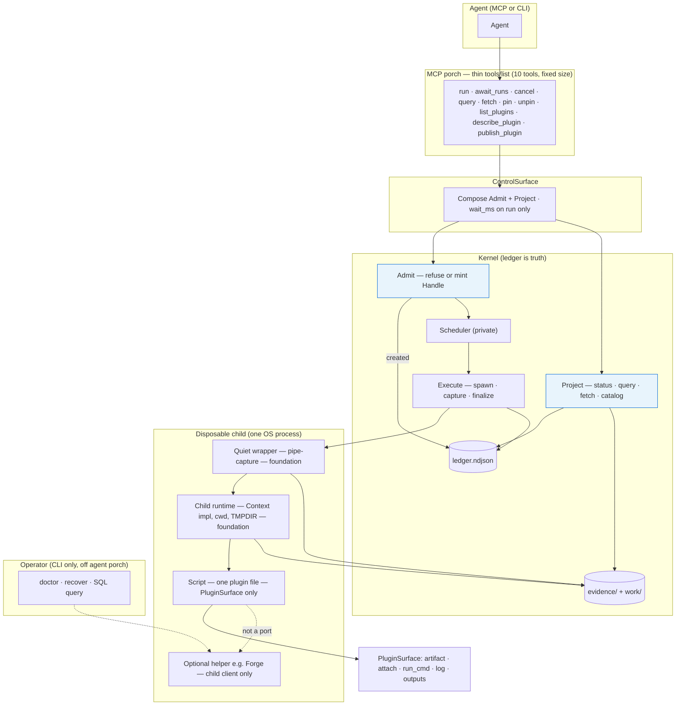
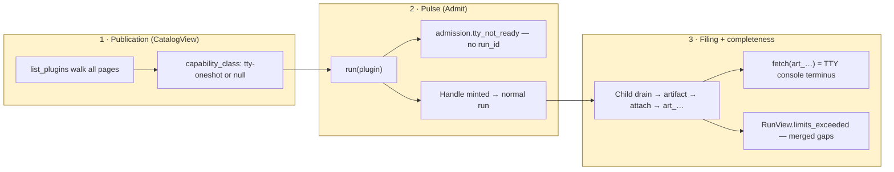

# What the plan is — Trestle

**Status:** reader-facing synthesis (2026-08-25).  
**Authority:** requirements and frozen interface docs — not a replacement for them.

| Document | Role |
|----------|------|
| [`trestle-requirements.md`](../trestle-requirements.md) | What must be true |
| [`hld-interface-architecture-trestle.md`](hld-interface-architecture-trestle.md) | Freeze HLD: three ports, ten tools, envelopes |
| [`docs/agent-console-mcp.md`](../docs/agent-console-mcp.md) | Agent MCP playbook (Phase C — attach, retrieval, smoke) |
| [`hld/interface-design-agent-plugin-interface.md`](interface-design-agent-plugin-interface.md) | Agent plugin lifecycle contract (APL-01–08) |
| [`hld/plan-daytona-clean-room-scope.md`](plan-daytona-clean-room-scope.md) | Console access scope plan (Phase C complete) |
| [`hld-tty-overlay-trestle.md`](hld-tty-overlay-trestle.md) | TTY overlay HLD (additive only) |
| [`interface-design-tty-class-trestle.md`](interface-design-tty-class-trestle.md) | TTY consumer contract |

---

## Verdict

The plan is sound: one durable ledger, ten small agent tools, and optional terminal work that either uses those same tools or clearly tells the agent to go elsewhere — without bloating what the host injects every turn.

Build the core milestones first; add TTY as a plugin publication, not a platform rewrite.

---

## What the plan is

Trestle is a **local execution ledger** (the durable record of what ran) with a **thin MCP front door** (ten fixed tools the agent sees). The **foundation** (Kernel, wrapper, child runtime) **wraps scripts**; scripts never wrap the foundation. The ledger is truth; the run directory holds evidence; workers are disposable; the agent only sees bounded projections (summaries, handles, slices — not raw filesystem paths).

**Build order (milestones M0–M7):** protocol and spawn model first (mostly done), then skeleton → bounding → durability → waiting → query → hot reload → ops. Optional terminal capture is **not** a gate for M1–M7 — it can ship later as a plugin row.

**North star (G1):** minimize tokens and turns per completed task. That drives the thin `tools/list` rule: plugin argument schemas stay off the porch; validation happens when you `run`, not in every tool definition. Script authors see PluginSurface only — not those ten porch tools from inside the plugin file.

---

## What the interfaces are

Three layers, one authority:

| Layer | Role |
|-------|------|
| **Requirements v0.7** | What must be true (including script/foundation seam, optional TTY-class oneshot, automatic child runtime) |
| **Freeze HLD** (`hld-interface-architecture-trestle.md`) | The Kernel agreement: three ports, ten tools, envelopes |
| **Agent plugin interface** (`interface-design-agent-plugin-interface.md`) | Discovery, supply (`publish_plugin`), multi-path config — fixed porch count |
| **TTY overlay** (HLD + consumer contract) | Additive rules only — no fourth port; TTY does not add an eleventh tool |

### Three Kernel ports

The only ways the core talks outward:

1. **Admit** — accept or refuse a request (refusal = no run id).
2. **Execute** — drive one admitted run to completion (spawn, capture, finalize).
3. **Project** — pictures of runs: status, query views, fetch slices, catalog.

### Agent surface

Ten tools: `run`, `await_runs`, `cancel`, `query`, `fetch`, `pin`, `unpin`, `list_plugins`, `describe_plugin`, `publish_plugin`. Not one tool per plugin.

### Key envelopes

Opaque handles (`r_…`, `art_…`), refusals (`RequestOutcome`), run status (`RunView` with a small default success shape), paginated query (`BoundedView`), plugin list (`CatalogView`), byte slices (`FetchSlice`).

### TTY overlay (same ten tools)

Four ideas on top — still no new port or tool:

| Mouth | Question it answers |
|-------|---------------------|
| **Catalog** | Does this install *claim* terminal-style oneshot work? (`capability_class`) |
| **Admit** | Is *this request* ready right now? (`admission.tty_not_ready` if not) |
| **Context filing** | Where do console bytes go? (attached artifacts, not pipe tails) |
| **Status frame** | Were bytes dropped? (`limits_exceeded`, merged wrapper + child gaps) |

**Forge** (or any helper) stays **inside the child** — not a port, not an MCP tool, not in agent grammar.

---

## Evaluation (plain language)

### What works well

- **Clear product identity.** Ledger-first, MCP-second. FastMCP is an adapter, not the executor.
- **Request vs run is explicit.** “Refused” never looks like a failed run — critical for agents.
- **Context-budget discipline.** Ten stable tools, no schema inflation, bounded default payloads — aligned with G1/G4.
- **Plugin model is automatic for authors.** One Python file on the script side of the foundation; child cwd is `work/`; write keepers under `outputs/` and they attach themselves; prints, logs, and in-group subprocesses are captured without extra APIs. Scripts do not import Kernel or MCP.
- **TTY extension is disciplined.** Use-not-absorb: optional class on the catalog, one unreadiness code, same handles/views/fetch. Ordinary pipe commands stay the default path.
- **Security posture is coherent.** Untrusted bytes only cross as bounded projection (R-INV-1); fetch never takes paths.

### Where complexity remains (design is done; implementation must earn it)

- **Two-pump execution:** wrapper still captures pipes; TTY console is a separate child drain into attached files. Easy to get wrong in code if someone treats `run_tail` as “TTY done.”
- **Gap counting path:** child writes observation files under `work/`; Kernel merges with wrapper limits into one `limits_exceeded` list. Subtle but load-bearing for “finished but incomplete.”
- **Helper topology deferred.** Daemon vs in-child PTY is intentionally not frozen — agreement can ship before helper topology is chosen.
- **Long waits on stdio.** v0.1 wait is `wait_ms` / `await_runs` on a held stdio call. No Tasks mapper (R-WAIT-4).
- **Agreement checkboxes** in overlay HLD are still “proposed” — docs converged; implementation should treat freeze + overlay as the contract set.

### Overall verdict

The architecture is **internally consistent and implementable**. The hard part is not more design surface — it’s honoring the seams in code (thin porch, three mouths, two pumps, merged gaps). M1–M7 can proceed without TTY; TTY is a well-bounded optional layer.

---

## Architecture diagram

### Core stack



### TTY overlay — three mouths



### End-to-end happy path

```text
Agent
  │  list_plugins  →  names + optional capability_class
  │  run(plugin, args, wait_ms?)
  │     Admit  →  refuse (no run_id)  OR  Handle + ledger created
  │     Execute  →  wrapper spawns child
  │        ordinary:  pipes → wrapper console/*
  │        TTY-class:  helper in child → drain → attach(art_…)  [wrapper still pipes]
  │     Project  →  RunView (small summary + limits_exceeded on terminal)
  │  fetch / query  →  bytes and views via handles only
  │
  └─  TTY console: fetch(art_…), NOT empty run_tail
```

---

## Bottom line

You have a frozen core (three ports, ten thin tools, ledger truth) plus a small, optional terminal overlay that respects context limits and keeps helpers substitutable. Build the core milestones first; add TTY as a plugin publication, not a platform rewrite.
