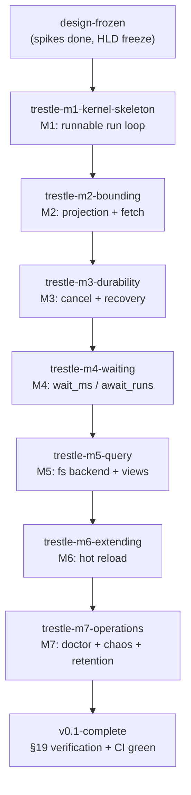

# Trestle v0.1 — Tech Tree

**Program:** trestle-v01  
**Entry:** design-frozen (brownfield)  
**Goal:** v0.1-complete (M1–M7)

## Graph

## Integration waves

| Wave | Gate after | Bulkheads exercised |
|------|------------|---------------------|
| W1 | M1 | I01, I02, I04 — round-trip run → status frame |
| W2 | M2 | I03 — projection + fetch + auto-promote |
| W3 | M4 | I03 + I04 — agent workflow US-01, US-04, US-05 |
| W4 | M7 | Full battery R-VER-* + CI |

## Unit summary

| Unit | Features | Files (est.) | Budget | Status |
|------|----------|--------------|--------|--------|
| trestle-m1-kernel-skeleton | 1 (M1) | ~18 | pass | queued |
| trestle-m2-bounding | 1 (M2) | ~12 | pass | proposed |
| trestle-m3-durability | 1 (M3) | ~10 | pass | proposed |
| trestle-m4-waiting | 1 (M4) | ~8 | pass | proposed |
| trestle-m5-query | 1 (M5) | ~14 | pass | proposed |
| trestle-m6-extending | 1 (M6) | ~8 | pass | proposed |
| trestle-m7-operations | 1 (M7) | ~12 | pass | proposed |

## Dispatch order (auto kickoff)

1. `/project-pipeline trestle-m1-kernel-skeleton entry_profile=hld_and_plan`
2. `/project-pipeline trestle-m2-bounding entry_profile=hld_and_plan`
3. `/project-pipeline trestle-m3-durability entry_profile=hld_and_plan`
4. `/project-pipeline trestle-m4-waiting entry_profile=hld_and_plan`
5. `/project-pipeline trestle-m5-query entry_profile=hld_and_plan`
6. `/project-pipeline trestle-m6-extending entry_profile=hld_and_plan`
7. `/project-pipeline trestle-m7-operations entry_profile=hld_and_plan`

## Invariants

- Single start: design-frozen  
- Single goal: v0.1-complete  
- Acyclic prerequisites chain  
- Full coverage: M1–M7 trace to §23  
- Single-owner bulkheads per [00-projects-and-bulkheads.md](architecture/00-projects-and-bulkheads.md)  
- All units `budget_assessment: pass` at portfolio gate
